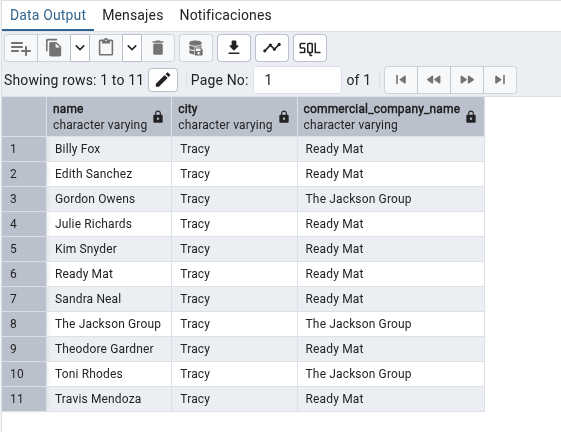

# Tarea 12 Odoo
## Apartado 1
`Como mencionamos en clase, aunque no es recomendable, en ocasiones puede ser
necesario crear tablas ajenas a Odoo dentro de su base de datos (integración con
sistemas externos, almacenamiento de históricos, datos temporales…). Mediante la
herramienta PgAdmin u otro método que estimes oportuno, elabora y ejecuta una
sentencia que cree una tabla llamada “EmpresasFCT“con los siguientes campos:`
- Creamos una nueva tabla y añadimos las columnas


## Apartado 2

`Inserta 5 registros inventados en la tabla a través de una sentencia SQL.`

- Creamos la siguiente sentencia SQL para insertar los registros


## Apartado 3

`Realiza una consulta donde se muestren todos los datos de la tabla EmpresasFCT
ordenados por fechaContacto, de modo que en la primera la salga el que tenga la
fecha más reciente.`

```sql
SELECT * FROM public."EmpresasFCT"  
ORDER BY "fechaContacto" DESC;
```


## Apartado 4
`Realiza una consulta que permita obtener un listado de todos los contactos de
Odoo (no empresas) con la siguiente información:`

- Nombre
- Ciudad: Tracy
- Nombre comercial de la empresa


```sql
select "name", "city", "commercial_company_name"
from public.res_partner
where "city" = 'Tracy'
order by "name";
```


## Apartado 5
`Utilizando las tablas de odoo, obtén un listado de empresas proveedoras, que han
emitido algún reembolso (facturas recticativas de proveedor)`

- Nombre de la empresa
- Número de factura
- Fecha de la factura
- Total factura SIN impuestos

```sql
SELECT 
    res_partner."name", 
    account_move."name", 
    account_move."invoice_date", 
    account_move."amount_untaxed"
FROM public.account_move
JOIN public.res_partner ON account_move."partner_id" = res_partner."id"
WHERE account_move."move_type" = 'in_refund'
AND res_partner."is_company" = TRUE
ORDER BY account_move."invoice_date" DESC;
``` 


## Apartado 6
`Utilizando las tablas de odoo, obtén un listado de empresas clientes, a las que se les
ha emitido más de dos facturas de venta (solo venta) conrmadas, mostrando los
siguientes datos:`

- Nombre de la empresa
- Número de facturas
- Total facturado SIN IMPUESTOS

```sql
SELECT 
    "invoice_partner_display_name", 
    COUNT("id"), 
    SUM("amount_untaxed")
FROM public.account_move
WHERE "move_type" = 'out_invoice'
AND "state" = 'posted'
GROUP BY "invoice_partner_display_name"
HAVING COUNT("id") > 2
ORDER BY SUM("amount_untaxed") DESC;
```


